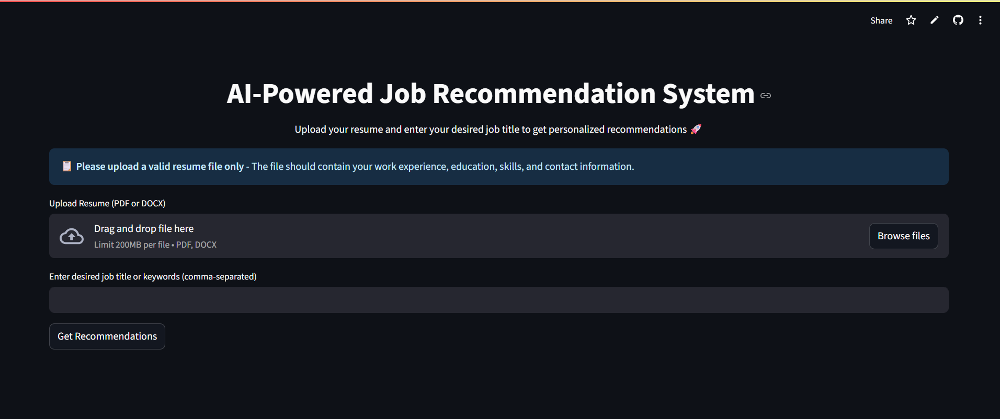

# 💼 AI-Powered Job Recommendation System using LangChain & Gemini

## 🎯 Objective
A smart job recommendation web application that helps students and professionals discover suitable jobs or internships by matching their skills, experience, and preferences using LLM-based Retrieval-Augmented Generation (RAG) techniques.

The system lets users upload a resume and enter desired job titles or keywords, retrieves real-time job postings from sources like Google Jobs / LinkedIn Jobs (via RapidAPI), and uses LangChain + Google Gemini for intelligent matching with similarity scores and concise justifications.

---

## 🌐 Live Demo
Public Streamlit App:  
https://ai-powered-job-recommendation-system.streamlit.app/

---

## 🛠️ Features
- 📄 Resume upload (PDF)
- 🖊 Keyword search (job title, skills, location)
- 🌐 Live job retrieval (Google Jobs / LinkedIn Jobs via RapidAPI)
- 🤖 LLM-powered matching (LangChain + Gemini)
- 📊 Vector similarity (FAISS)
- 🧠 Justifications (why the job matches the resume)
- 🖥 Streamlit UI (simple and responsive)
- 🔌 Modular architecture (easily extend job sources and models)

---

## ⚙️ Tech Stack

| Component       | Technology                |
|-----------------|---------------------------|
| Programming     | Python                    |
| LLM Integration | LangChain + Google Gemini |
| Vector Store    | FAISS                     |
| UI Framework    | Streamlit                 |
| Deployment      | Streamlit Cloud / GitHub  |

---

## 📂 Folder Structure
```
project-root/
│
├── app.py                      # Streamlit app entry point
├── .env                        # API keys and environment variables
├── requirements.txt
├── README.md
│
├── faiss_job_index_miniLM/     # Saved FAISS index (generated)
│
├── notebooks/
│   └── check                   # Colab/experiments and debugging
│
├── App_Snaps/                  # Screenshots of the app interface
│   ├── App_Interface.png
│   └── App_Screenshot_Post_Job_Matching.png
│
└── src/
    ├── settings.py             # Config, API setup, model/embeddings init
    ├── resume_parser.py        # Resume extraction & text processing
    ├── jobs_scrapping.py       # Job scraping via RapidAPI
    ├── embeddings_model.py     # Embeddings + FAISS utilities
    ├── similarity_checks.py    # Vector similarity logic
    ├── chain.py                # LLM prompt for match reasoning
    ├── final_chain.py          # Runnable pipeline assembly
    └── main.py                 # Local testing and scripting
```

---

## 🖼️ Screenshots
Place your screenshots inside the new App_Snaps folder and ensure the filenames match.

- Home Page (Upload + Input)  
  

- Recommendations (with Justifications)  
  

---

## 🚀 How to Run Locally

### 1) Clone the Repository
```
git clone https://github.com/yourusername/job-recommender.git
cd job-recommender
```

### 2) Create and Activate a Virtual Environment
```
python -m venv venv
source venv/bin/activate       # Mac/Linux
venv\Scripts\activate          # Windows
```

### 3) Install Dependencies
```
pip install -r requirements.txt
```

### 4) Configure Environment Variables
Create a `.env` file at the project root:
```
GROQ_API_KEY=your_groq_api_key # if using Groq + Llama model
RAPIDAPI_KEY=your_rapidapi_key
RAPIDAPI_HOST=jsearch.p.rapidapi.com
GEMINI_API_KEY=your_gemini_key
```

### 5) Run the App
```
streamlit run app.py
```

This opens the app in a browser (default: http://localhost:8501).

---

## ⚡ Usage
1. Open the app (locally or via the public link).
2. Upload your resume (PDF) or provide a job title/keywords.
3. Click “Get Recommendations”.
4. Review ranked jobs with company name, job title, apply link, similarity score, and match justification.

---

## 📝 Sample Input
- Job Title / Keywords:
```
Data Scientist, AI Engineer
```
- Resume fields expected:
  - job_title, experience_years, skills, education, certifications, preferred_job_type

---

## 📊 Sample Output
```
[
  {
    "company_name": "Turing",
    "job_title": "Remote Data Scientist",
    "apply_link": "https://example.com/apply",
    "match_justification": "Machine Learning: Resume lists Machine Learning and Model Building as skills. Model Development: Resume lists Model Building as a skill. Artificial Intelligence: Resume lists 'Advanced Certification in Full Stack Data Science & AI' as a qualification.",
    "Similarity Score": "0.82"
  },
  {
    "company_name": "Signant Health",
    "job_title": "Lead ML Engineer",
    "apply_link": "https://example.com/apply",
    "match_justification": "Location: Resume lists Noida as preferred location. Data Science: Resume lists 'Advanced Certification in Full Stack Data Science & AI' as a qualification. Machine Learning: Resume lists Machine Learning, Model Building, and Scikit-Learn as skills. Python: Resume lists Python as a skill. SQL: Resume lists SQL and PostgreSQL as skills. Pandas: Resume lists Pandas as a skill.",
    "Similarity Score": "0.78"
  }
]
```

---

## 🔧 Implementation Notes
- Dynamic queries: the job title from Streamlit is passed into the pipeline and used to build the RapidAPI query per request.
- FAISS index: job postings are embedded and stored for similarity lookup; can be cached or persisted in `faiss_job_index_miniLM/`.
- LLM grounding: prompts are designed to minimize hallucinations; consider post-validation (whitelisting skills extracted from the resume) for stricter control.
- Modularity: swap embeddings or vector stores, add job sources, and adjust prompts without changing the UI.

---

## 🧩 Extensibility
- Add new job sources (Indeed, Greenhouse, Lever) by extending `jobs_scrapping.py`.
- Swap embeddings (e.g., OpenAI, Instructor, E5) in `settings.py`.
- Replace FAISS with Chroma or a managed vector DB (Pinecone, Weaviate, Milvus).
- Strengthen guardrails: add post-filters to ensure justifications cite resume skills only.

---

## 🏢 Industry Value & Scaling (Interview Talking Points)
- Business impact: Faster shortlisting, improved candidate experience, explainable recommendations.
- Scale path: Move from local FAISS to distributed vector DB, add caching, hybrid retrieval (sparse+dense), and managed model endpoints.
- Use cases: Talent acquisition (ATS/HR), job boards/marketplaces, university career services, staffing agencies.

---
